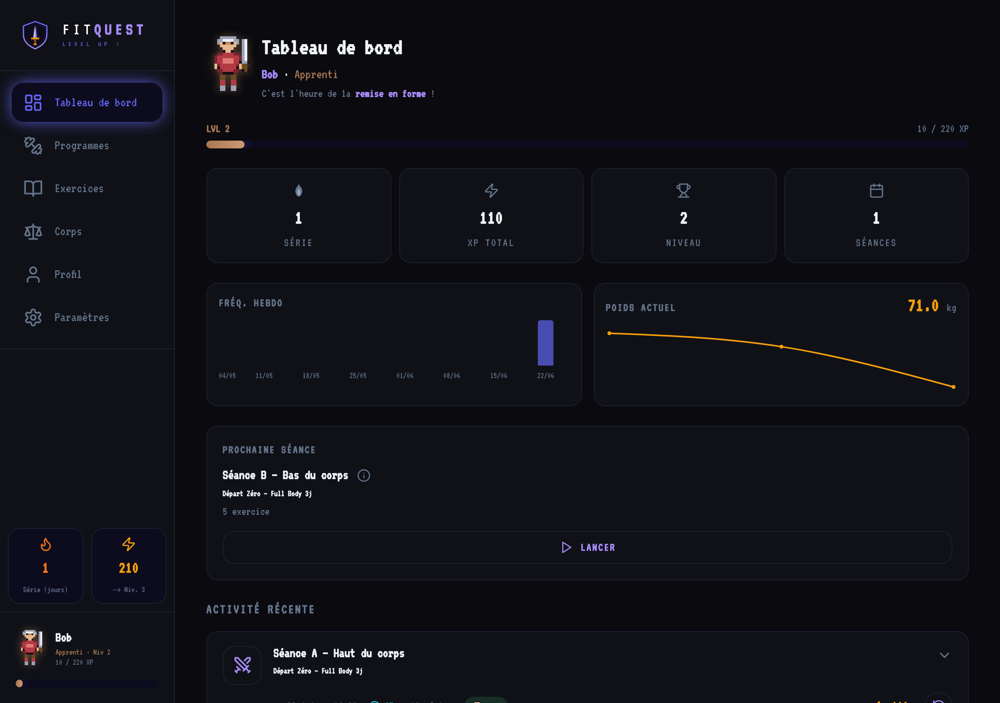
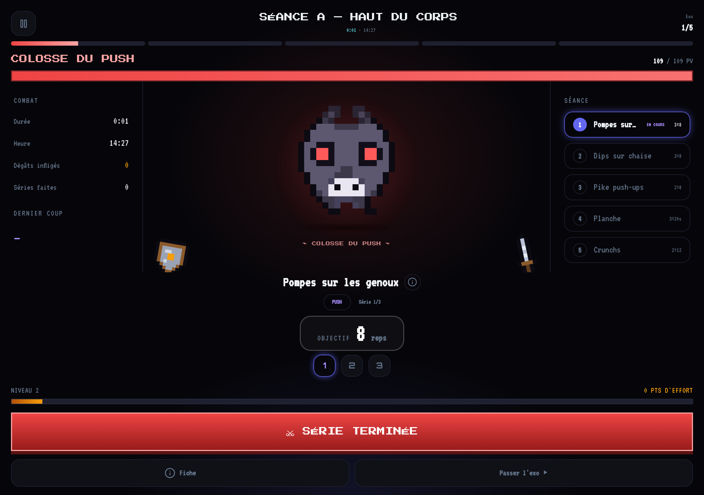
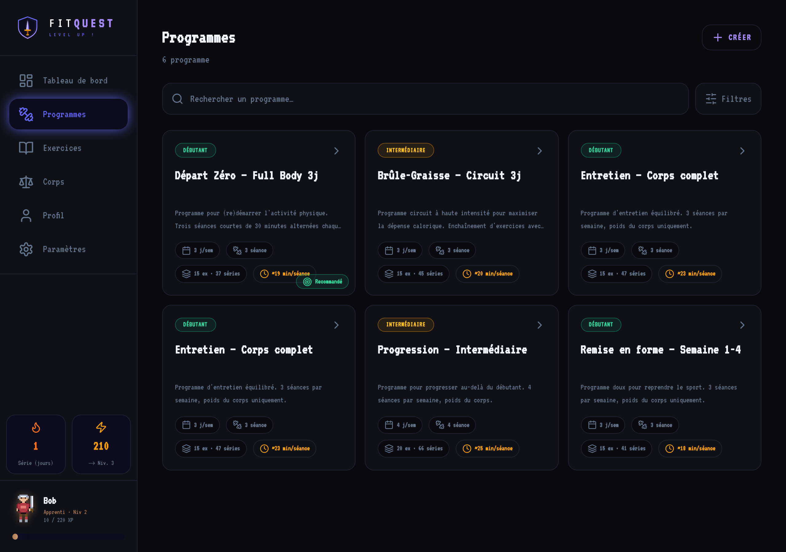
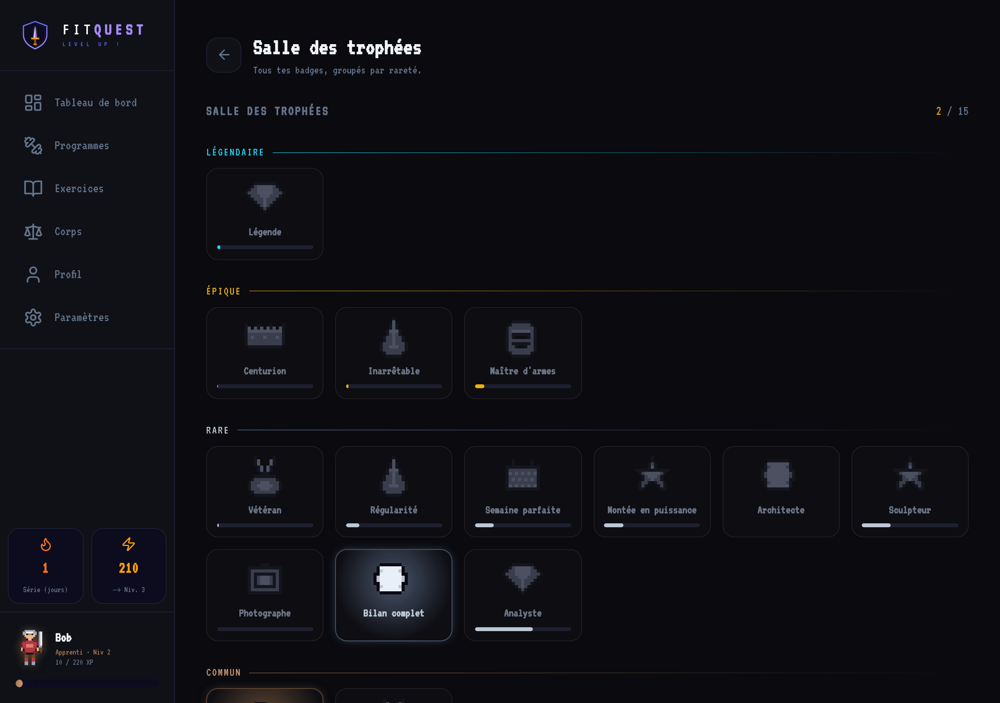

# FitQuest

Web app de renforcement musculaire gamifiée (RPG). Self-hosted, déploiement Docker en une commande.

## Aperçu

| Tableau de bord | Séance — Boss Fight |
|---|---|
|  |  |

| Programmes | Gamification |
|---|---|
|  |  |

## Stack

- **Frontend** : React 18 + Vite + TypeScript (strict) · TailwindCSS + shadcn/ui · Zustand · React Router · react-i18next · Recharts
- **Backend** : Node/Express + TypeScript · PostgreSQL + Prisma · JWT + bcrypt · Multer
- **Infra** : Docker Compose · Nginx reverse proxy · PWA (manifest + service worker)

## Fonctionnalités

- **Authentification & création de personnage RPG** — inscription en 4 étapes, choix parmi 4 classes (Guerrier, Archer, Mage, Chevalier)
- **Séance active — Boss Fight pixel art** — boss généré selon la catégorie d'exercices, arme interchangeable, forge animée entre les séries, mécanique de surpassement, combo de dégâts, écran victoire/survie
- **XP / niveaux / paliers** — courbe quadratique, 5 paliers (Bronze → Diamant), 11 badges pixel art (premier pas, régularité, streak, architecte, sculpteur, photographe…)
- **Avatar évolutif pixel art** — 4 classes × 5 stades, accessoires cumulatifs, auras et effets CSS par palier
- **Métriques corporelles + photos de progression** — saisie poids/mensurations/custom, graphiques recharts par métrique, galerie de photos avec comparaison côte à côte, mode confidentialité
- **Programmes & builder d'exercices** — CRUD programmes/séances, builder drag-free, bibliothèque filtrée, fiches exercices
- **Dashboard** — graphique 12 semaines, sparkline poids, streak animé, prochaine séance, XP bar palier
- **Historique des séances** — cartes dépliables, filtres période et programme, statistiques résumées, bouton Relancer
- **3 thèmes** — `void_rpg` (défaut), `forest_warrior`, `solar_blaze` — appliqués via `data-theme` sur toutes les pages
- **PWA installable** — manifest, icônes 192/512, apple-touch-icon, métas iOS, safe-area Dynamic Island

## Démarrage rapide

### Avec Docker (recommandé)

```bash
cp .env.example .env          # adapter les secrets (voir section Variables d'env)
docker compose up -d --build  # dev : db + backend nodemon + frontend Vite
```

- Frontend : http://localhost:5173
- Backend  : http://localhost:3001/api/v1/health

Production :

```bash
docker compose -f docker-compose.prod.yml up -d --build
```

### Sans Docker

Prérequis : PostgreSQL local + Node 20+.

```bash
# Backend (port 3001)
cd backend && npm install
cp ../.env.example ../.env   # adapter DATABASE_URL pour Postgres local
npx prisma db push && npx prisma db seed
npm run dev

# Frontend (port 5173, dans un autre terminal)
cd frontend && npm install
npm run dev
```

## Production — Proxmox VE (LXC)

### Créer la LXC depuis l'hôte PVE (en root)

```bash
bash -c "$(curl -fsSL https://raw.githubusercontent.com/RaphPi/fitquest/main/ct/fitquest.sh)"
```

Crée une LXC Debian 12 (`nesting=1` / `keyctl=1` pour Docker), installe Docker et l'app,
lance `docker-compose.prod.yml`, migre et seed la base, puis affiche l'URL.

Paramètres optionnels :

```bash
CTID=120 CT_HOSTNAME=fitquest RAM_MB=4096 CORES=2 DISK_GB=12 APP_PORT=80 \
  bash -c "$(curl -fsSL https://raw.githubusercontent.com/RaphPi/fitquest/main/ct/fitquest.sh)"
```

### Installer sur un hôte existant (sans créer de LXC)

```bash
bash <(curl -fsSL https://raw.githubusercontent.com/RaphPi/fitquest/main/scripts/install.sh)
```

### Mettre à jour

Depuis l'intérieur de la LXC :

```bash
update
```

Depuis l'hôte PVE sans entrer dans la LXC :

```bash
pct exec <CTID> -- update
```

## PWA / iPhone

Pour installer FitQuest sur l'écran d'accueil iOS :

1. Ouvrir l'URL de l'app dans **Safari**
2. Appuyer sur l'icône **Partager** (carré avec flèche vers le haut)
3. Sélectionner **"Sur l'écran d'accueil"**
4. Confirmer avec **Ajouter**

L'app se lance alors en mode plein écran (standalone), avec prise en charge de la Dynamic Island et du home indicator.

## Variables d'environnement

Copier `.env.example` en `.env` et adapter les valeurs. Le script `install.sh` génère automatiquement `JWT_SECRET`.

| Variable | Rôle |
|---|---|
| `APP_PORT` | Port public exposé par nginx (défaut : 80) |
| `PORT` | Port interne du backend Express (défaut : 3001) |
| `NODE_ENV` | `production` ou `development` |
| `UPLOAD_DIR` | Répertoire de stockage des photos de progression (défaut : `uploads`) |
| `POSTGRES_USER` | Utilisateur PostgreSQL |
| `POSTGRES_PASSWORD` | Mot de passe PostgreSQL (**à changer**) |
| `POSTGRES_DB` | Nom de la base de données |
| `DATABASE_URL` | URL de connexion Prisma — `db` = nom du service Docker Compose |
| `JWT_SECRET` | Clé de signature JWT (**à changer** — `openssl rand -hex 32`) |
| `JWT_EXPIRES_IN` | Durée de validité du token (ex. `7d`, `30d`) |
| `COOKIE_SECURE` | `true` uniquement si HTTPS est activé côté reverse proxy |
| `AI_PROVIDER` | `none` \| `claude` \| `ollama` \| `lmstudio` (optionnel) |
| `CLAUDE_API_KEY` | Clé API Anthropic (requis si `AI_PROVIDER=claude`) |
| `OLLAMA_URL` | URL de l'instance Ollama sur le réseau local |
| `LMSTUDIO_URL` | URL de l'instance LM Studio sur le réseau local |
| `FREESMS_TOKEN` | Token FreeSMS pour notifications SMS (optionnel) |
| `HOME_ASSISTANT_URL` | URL Home Assistant (optionnel) |
| `HOME_ASSISTANT_TOKEN` | Token long-lived Home Assistant (optionnel) |
| `WEBHOOK_URL` | Webhook générique — Discord, Slack, n8n, Make… (optionnel) |
| `PUPPETEER_SKIP_DOWNLOAD` | `true` — évite le téléchargement de Chromium (Phase 2) |

## Évolutions prévues (Phase 2)

- **IA multi-provider** — génération de programme personnalisé via questionnaire (Claude API, Ollama, LM Studio) + illustrations d'exercices générées par IA
- **Notifications** — web push, SMS FreeSMS, Home Assistant, webhook générique (rappels séance, badges débloqués)
- **Export fiche personnage PDF** — avatar, niveau, badges, métriques, top exercices, graphique fréquence (Puppeteer)
- **Export de données** — CSV et JSON complets (historique, métriques, photos)
- **Email digest** — synthèse périodique (quotidienne / hebdomadaire / mensuelle)
- **i18n complet** — FR / EN sur l'ensemble de l'app
- **Widgets sidebar configurables** — mini-graphes, lancement rapide séance, personnalisables dans les paramètres
- **Changement de personnage** — sélecteur de classe accessible après l'inscription
- **Panel admin** — gestion des utilisateurs, purge sélective, statistiques globales
- **Gestion de compte (utilisateur)** — suppression du compte, export profil RGPD (JSON), import / restauration
- **Partage communauté** — import / export de programmes au format JSON
- **Sync multi-appareils** — compte cloud optionnel

## Structure

```
fitquest/
├── docker-compose.yml          # dev
├── docker-compose.prod.yml     # production
├── nginx/nginx.conf            # reverse proxy
├── ct/fitquest.sh              # créateur de LXC Proxmox
├── scripts/{install,update}.sh # installation et mise à jour
├── frontend/                   # React + Vite
└── backend/                    # Express + Prisma
```
